# 🧑‍💻 팀 중급 프로젝트

---

## 👥 팀원 구성

| 이름       | 역할        | GitHub                                                       | 개인 개발 블로그                                                   |
| ---------- | ----------- | ------------------------------------------------------------ | ---------------------------------------------------------------- |
| **오창섭** | 백엔드 개발 | 🔗 [GitHub](https://github.com/GhostGN95)                    | 🔗 [노션](https://www.notion.so/271f69649eac80b09853ca55641bdbe6)                                                         |
| **김경연** | 백엔드 개발 | 🔗 [GitHub]https://github.com/gyeongyeonkmy/study            | 🔗 [https://velog.io/@gyeongyeonk/posts]-                        |
| **정인성** | 백엔드 개발 | 🔗 [GitHub](https://github.com/jung-insung?tab=repositories) | 🔗 [insungcoding.tistory.com](https://insungcoding.tistory.com/) |
| **최지혜** | 백엔드 개발 | 🔗 [GitHub](https://github.com/918-jihye?tab=repositories) | [노션](https://www.notion.so/CODE-IT-_-259bc88351b78087b0b0dd3e68ac20d5) |

---

## 📘 프로젝트 소개

**프로그래밍 교육 사이트의 백엔드 시스템 구축**

- **프로젝트 기간:** 2025.11.10 ~ 2025.12.02
- **주요 목표:** 사용자 관리 및 권한 기반의 백엔드 서비스 설계 및 구현
- ([팀 협업 문서 링크](https://www.notion.so/NB_05-2-Dear-Carmate-2ac3fdc694758080ae96d16cf56ed8aa?source=copy_link))

---

## 🧰 기술 스택

| 구분          | 사용 기술                     |
| ------------- | ----------------------------- |
| **Backend**   | Express.js, PrismaORM         |
| **Database**  | PostgreSQL                    |
| **공통 Tool** | Git & GitHub, Discord, Notion |
| **일정 관리** | GitHub Issues, Notion 타임라인 |
| **GIT BRANCH 전략** | GIT FLOW |

---

## 🔧 팀원별 구현 기능

### 🟦 김경연

- 고객 정보 관리 기능
  - 고객 등록: 고객의 신상을 간단한 메모와 함께 입력하여 고객 등록 가능
  - 고객 수정: 회사 내 고객 정보 수정
  - 고객 삭제: 회사 내 고객 정보 삭제
  - 고객 목록 조회
    - 등록된 고객 정보 목록 확인
    - 페이지네이션
    - 고객명, 이메일로 검색 가능
  - 대용량 업로드: csv 파일을 검증하여 고객 데이터 대용량 업로드 가능

- 계약 수정 기능
  - 계약 상태 수정: 계약 진행 현황(차량 확인, 가격 협의, 계약 성사 여부)에 따라 차량 정보 조회 시 차량의 거래 상태, 고객 정보 조회 시 고객의 계약 횟수가 반영됨
  - 계약 세부 내용 수정: 차량, 고객, 가격, 미팅 일정을 수정할 수 있음

  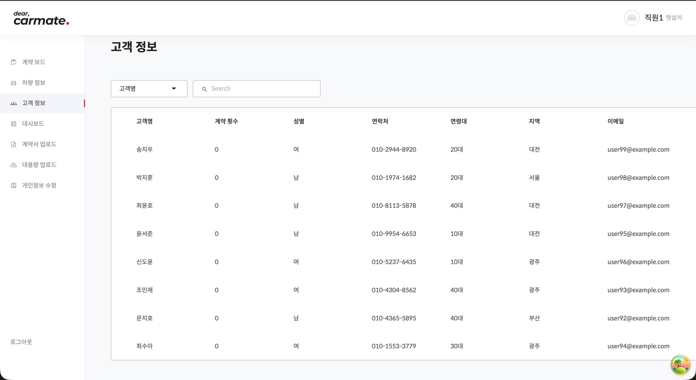
  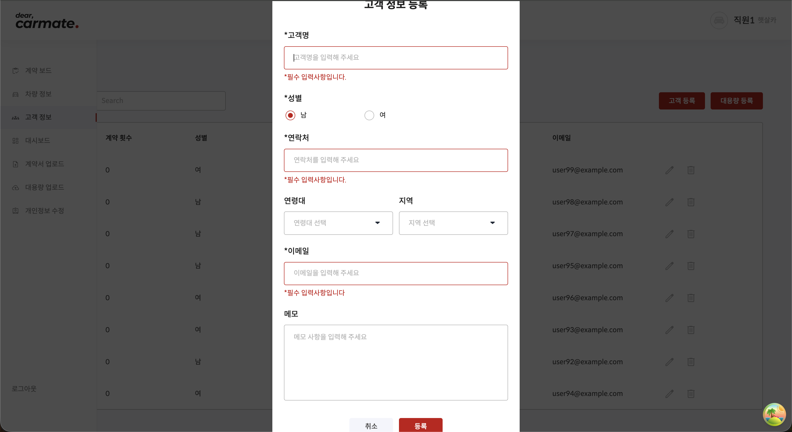
  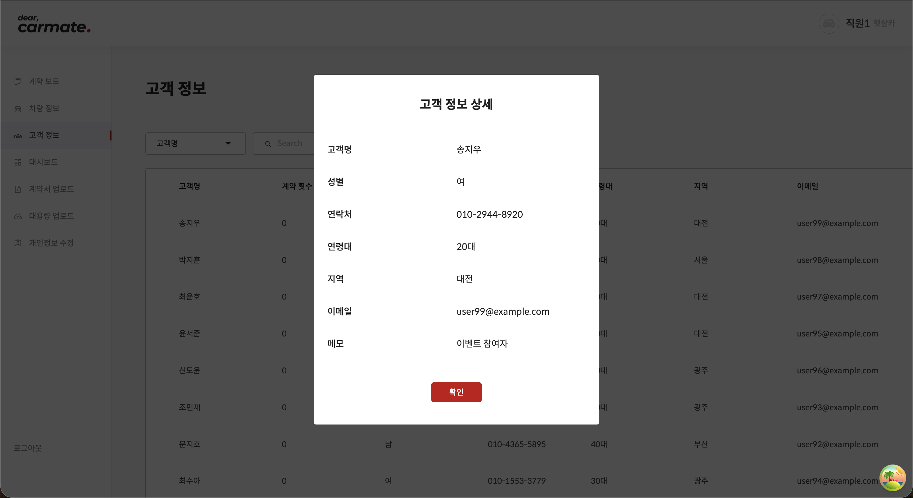
  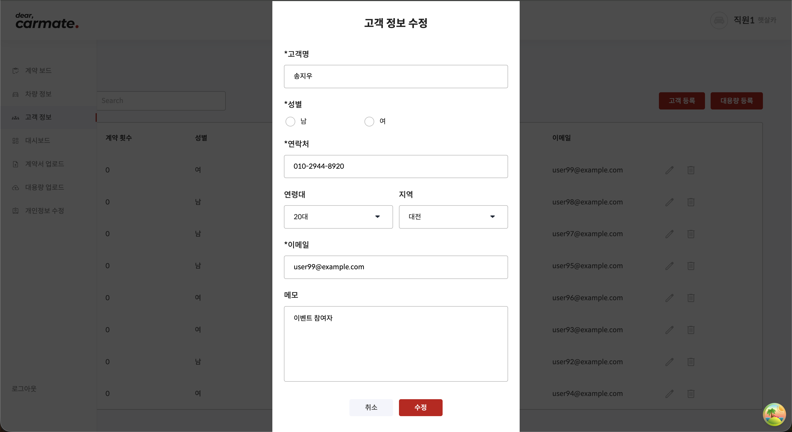
  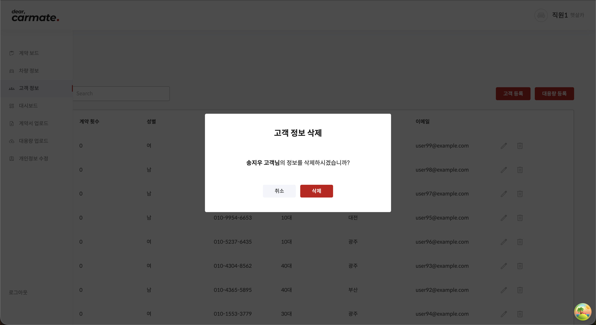
  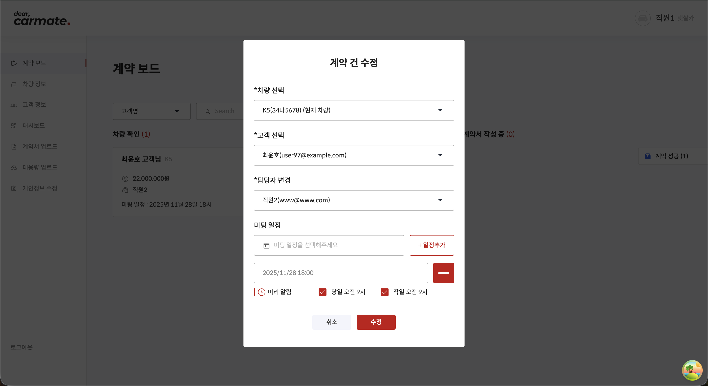

---

### 🟩 오창섭

(자신이 개발한 기능에 대한 사진이나 gif 파일 첨부)
- 어드민 API 구현
  - 어드민 전용 페이지
    - 어드민(관리자)만 접근할 수 있는 페이지
    - 기업 목록 / 기업별 유저 목록을 볼 수 있음
  - 기업 등록
    - 기업명과 기업 코드를 입력하여 기업을 등록할 수 있음
    - 유저의 회원가입 시, 올바른 기업명, 기업 코드가 요구됨
  - 기업 목록 조회
    - 등록된 기업 목록을 확인 가능
    - 기업명, 기업 코드, 사원수 표시
    - 기업명, 기업 코드로 검색 가능
    - 페이지네이션 기능 (한 페이지에 8곳씩 확인 가능)
  - 기업 수정
    - 등록된 기업명과 기업인증코드를 수정할 수 있음
    - 해당 기업과 연결된 유저의 소속이 함께 변경됨
  - 기업 삭제
    - 등록된 기업을 삭제할 수 있음
    - 해당 기업과 연결된 유저들의 정보가 cascade로 함께 삭제됨
  - 유저 목록 조회
    - 등록된 유저 목록을 확인 가능
    - 기업명, 이름, 이메일, 사원 번호, 연락처 표시
    - 기업명, 이름 이메일로 검색 가능
    - 페이지네이션 기능 (한 페이지에 8곳씩 확인 가능)
  - 유저 탈퇴
    - 등록된 유저를 탈퇴시킬 수 있음
- 계약 API 구현
  - 계약 목록 조회
    - 등록된 계약 목록을 확인 가능
    - 각 계약의 상태별로 목록 조회 가능
      - 차량 확인 / 가격 협의 / 계약서 작성 중 / 계약 성공 / 계약 실패
  - 계약 가능 차량 목록 조회
    - 계약에 등록 가능한 차량 목록을 조회함
      - 계약에 등록 가능한 차량의 상태는 '보유 중'이어야 함
        - 계약에 등록되지 않은 차량이거나, 또는 계약에 등록되었지만 계약 상태가 '계약 실패'에 해당하는 차량의 경우에 차량 상태가 '보유 중'으로 변경됨
      - 계약에 등록이 불가능한 차량의 상태는 '계약 진행중' / '계약 완료'임
        - 계약에 등록된 차량으로 계약 상태가 '차량 확인', '가격 협의', '계약서 작성 중'일 경우에 차량 상태가 '계약 진행중'으로 변경됨
        - 계약이 성사되어 계약 상태가 '계약 성공'일 경우에 이에 등록된 차량 상태는 '계약 완료"로 변경됨
  - 계약 가능 고객 목록 조회
    - 계약을 진행할 수 있는 고객 목록을 조회함
    - 한 명의 고객은 여러 계약을 맺을 수 있고, 계약 성사 여부와 관계없이 이후에도 계약을 맺을 수 있음
  - 계약 담당 유저 목록 조회
    - 계약 수정시 담당자(이하 담당 유저)를 변경할 수 있음
    - 담당 유저는 해당 계정이 속한 기업에 등록된 유저만 표출됨
  - 계약 삭제
    - 등록된 계약을 삭제할 수 있음

  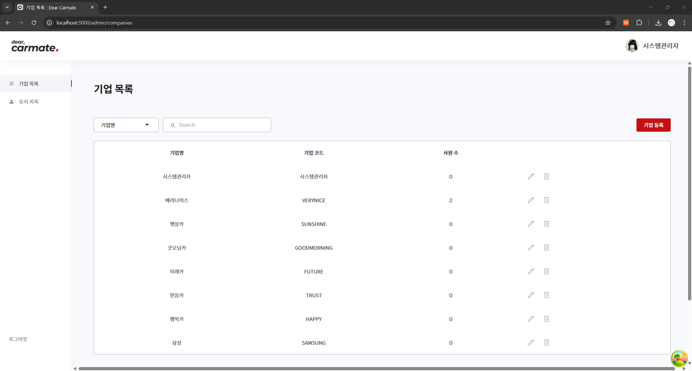

  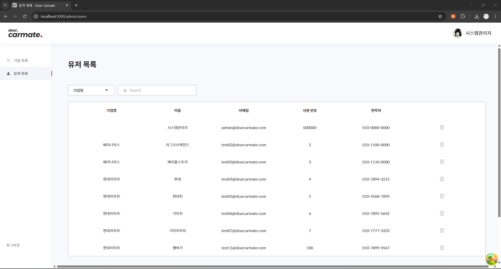

  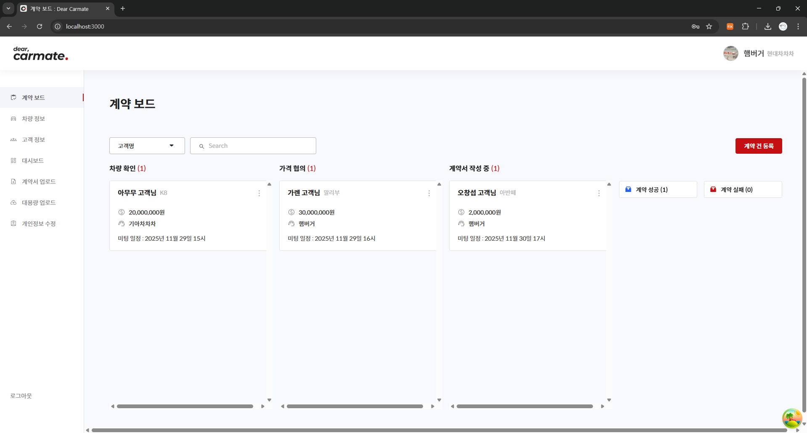

  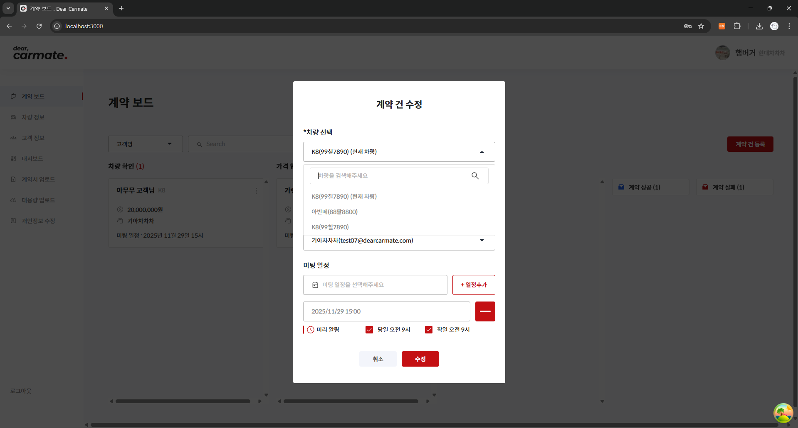

  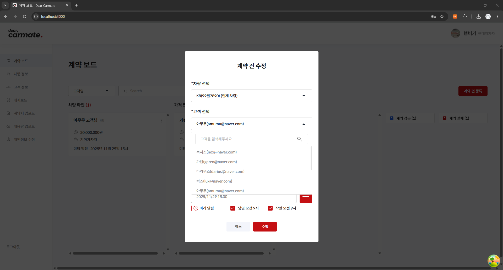

  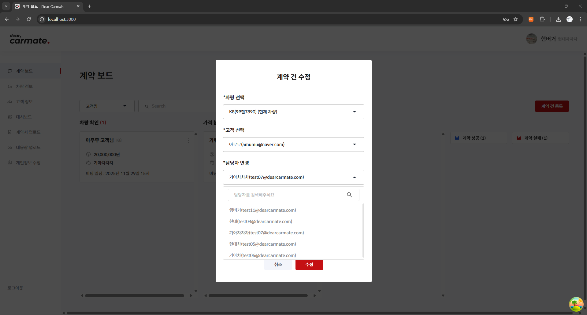

---

### 🟧 정인성

(자신이 개발한 기능에 대한 사진이나 gif 파일 첨부)
- 인증 API 구현
  - 로그인
    - 이메일, 비밀번호를 입력하여 로그인
    - 인증이 되면 JWT 토큰 발급해서 액세스 토큰하고 리플래쉬 토큰 발급
  - 로그아웃
    - 엔드포인트 없이 프론트엔드 코드에서 처리
- 유저 API 구현
  - 회원가입
    - 이름, 이메일, 사원번호, 연락처, 비밀번호, 기업명, 기업 인증코드를 입력하여 회원가입
    - 기업명과 기업 인증코드가 일치할 경우 회원가입에 성공하며, 로그인 시 유저가 속한 기업의 정보만 표시
  - 개인정보 수정
    - 수정 시도 시 비밀번호를 입력하여 2차 검증을 필요
    - 사원번호, 연락처, 비밀번호, 대표 이미지만 수정이 가능
- 계약서 API 구현
  - 등록
    - 거래 체결된 거래를 선택하고 계약서 파일을 추가 후 등록
  - 다운로드
    - 업로드된 계약서 일부 혹은 전체 다운로드
  - 수정
    - 등록된 계약서의 일부 혹은 전체를 삭제 및 추가 가능
  - 목록 조회
    - 등록된 계약서 목록을 확인
    - 계약서명, 계약체결일, 문서 수, 담당자, 차량번호 표시
    - 계약서명, 담당자로 검색 가능
    - 페이지네이션 가능
- 대시보드
  - 이 달의 매출, 지난 달의 매출, 계약 수, 성사된 계약 수, 차량타입별 계약수, 차량타입별 매출액을 표시

  
  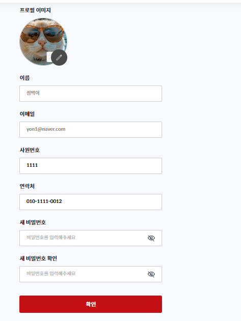

  
  

---

### 🟥 최지혜

- 차량 관리 API
  - 차량 등록
    -차량 번호, 제조사, 차종, 제조년도, 주행거리, 가격, 사고 횟수, 차량 설명, 사고 상세 정보를 입력하여 차량을 등록합니다.
    - 차량 설명, 사고 상세는 선택 입력 항목입니다.
    - 대용량 등록 기능을 통해 CSV 파일 업로드로 여러 차량 정보를 한 번에 등록할 수 있습니다. (대용량 등록 버튼 클릭 시 업로드 페이지로 이동)

  - 차량 수정
    - 유저가 속한 회사에 등록된 차량에 한해 수정이 가능합니다.
  
  - 차량 삭제
    - 유저가 속한 회사에 등록된 차량에 한해 삭제가 가능합니다.
  
  - 차량 목록 조회
    - 등록된 차량 목록을 조회할 수 있습니다.
    - 목록에서 차량 번호, 제조사, 차종, 주행거리, 제조년도, 가격, 계약 상태, 사고 횟수를 확인할 수 있습니다.
    - 페이지네이션을 지원합니다.
    - 차량 번호 또는 차종으로 검색할 수 있습니다.(공백 제거 / 대소문자 무시하여 검색 가능)

- 계약 등록 API
  - 계약 등록
    - 차량, 고객, 미팅 일정을 입력하여 계약 등록이 가능합니다.
    - 미팅 일정 설정(최대 3개)이 가능합니다.

  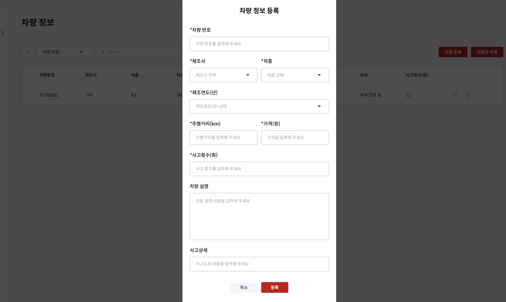
  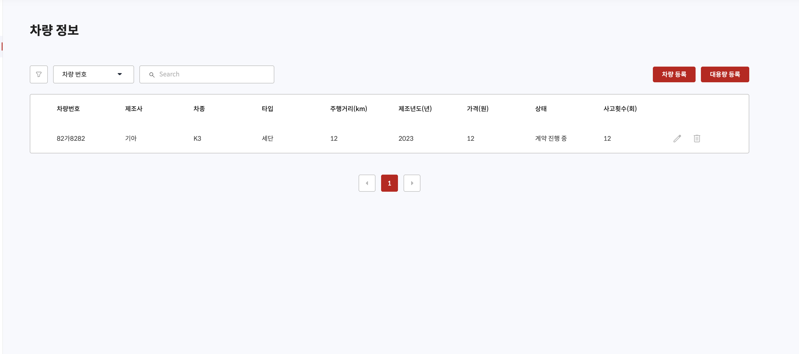

  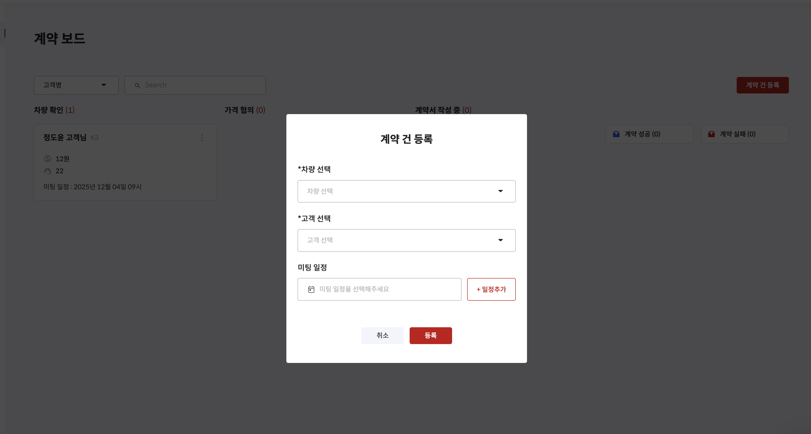

---

## 📁 파일 구조

<최종 때 수정>

<pre>
src
 ┣ config
 ┃ ┗ db.ts
 ┣ controllers
 ┃ ┣ auth.controller.ts
 ┃ ┗ user.controller.ts
 ┣ middleware
 ┃ ┣ auth.middleware.ts
 ┃ ┗ error.middleware.ts
 ┣ models
 ┃ ┣ user.model.ts
 ┃ ┗ course.model.ts
 ┣ routes
 ┃ ┣ auth.routes.ts
 ┃ ┗ user.routes.ts
 ┣ services
 ┃ ┣ auth.service.ts
 ┃ ┗ user.service.ts
 ┣ utils
 ┃ ┣ jwt.ts
 ┃ ┣ constants.ts
 ┃ ┗ logger.ts
 ┣ app.ts
 ┗ server.ts
prisma
 ┣ schema.prisma
 ┗ seed.ts
.env
.gitignore
package.json
tsconfig.json
README.md
</pre>

---

## 🌐 구현 홈페이지

[https://www.codeit.kr/](https://www.codeit.kr/)

---

## 🪞 프로젝트 회고록

(제작한 발표자료 링크 혹은 첨부파일 첨부)
